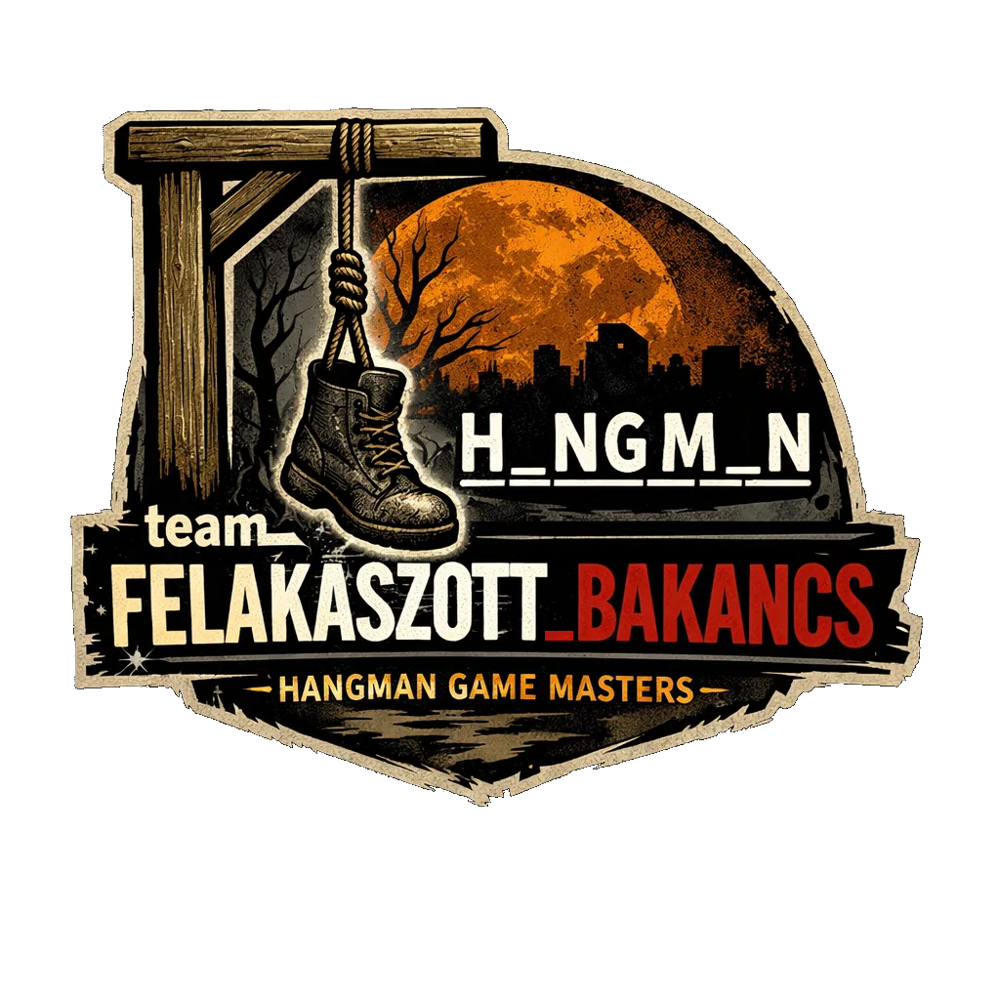

# Welcome to the _project of Bálint, Domi and Marci_

# We present you the project of *team_felakasztott_bakancs* 🥾
## We present you the project of *team_felakasztott_bakancs* 🥾


logo by: Sora ai🤖, promted by Domi and Marci

promts:
- change A_N_A_N to H_ng M_n
- further changes made in paint
- Finalised version:

    

___________________________________________________________________________________________________________________
# ReadMe  
-- Bálint  
-- Marci  
___________________________________________________________________________________________________________________
# Ascii art 
-- Iván Levi ötlete volt  
-- internetről szedtük  

___________________________________________________________________________________________________________________
# Commitok    
-- Mindenki commitolt  
-- voltak vele problémák  
-- nem mindig látszódott  

___________________________________________________________________________________________________________________
# Kommentek 
-- Iván Levi ötlete volt  
-- teljesen elfelejtettük  

___________________________________________________________________________________________________________________
# Kihívások 
-- kitalált betűk mutatása  
-- egyeztetni a kódrészleteket  
-- tudáshiány pl.: set()  
___________________________________________________________________________________________________________________
# Code snippetek   

-- score board --  
```
def scoreboard(score):
    try:
        with open("scoreboard.json", "r") as f:
            list = json.load(f)
    except:
        list=[]
    print("\n" + "="*10 + "HIGH SCORE" + "="*10)
    print("="*30)
    print(f"{'Rank':<5} {'Name':<12} {'Score':<10}")
    print("-" * 30)
    for i in range(len(list[:10])):
        Name=list[i]["name"]
        Score=list[i]["score"]
        print(f"{i+1:<5} {Name:<12} {Score:<10}")
    print("="*30)
    if len(list)>=10 and score<list[9]["score"] or len(list)<10:
        print(f"Gratulálok! Csupán {score} tippre volt szükséged, amivel bebiztosítottad a helyed a Top 10-ben!")
        adat=str(input("Adj meg egy nevet vagy nyomj Entert:")).strip()
        if adat!="":
            list.append({"name":adat, "score":score})
            list.sort(key=lambda x: x["score"],)
            with open ("scoreboard.json","w") as f:
                json.dump(list, f, indent=4,)
    print(f"{score} tipp kellett, ezzel a neved maximum fejfára kerül")
```

-- hiddenbe konvertálás --  
```
def mask_word(word, guessed):
    return "".join(ch if ch.lower() in guessed or ch == " " else "-" for ch in word)
```

-- egy kör lejátszása --  
```
def play_one_round(secret_word, label): #secret word         
    guessed = set() # egy elem csak 1x szerepelhet benne, elmenti a már kérdezett betűket
    errors = 0
    score = 0
```
___________________________________________________________________________________________________________________

 
# Pék Dominik  
-- fájl kezelése  
-- score board  
___________________________________________________________________________________________________________________ 
# Juhász Bálint  
-- while cikklusok  
-- for cikklusok  
-- függvények  
___________________________________________________________________________________________________________________
  
# Rónai Márton  
-- ötlet adás  
-- függvény írás  
-- debugging  
___________________________________________________________________________________________________________________
## Végső gondolatok  
-- nehéz volt de megérte  
-- bővítette a tudásunkat  
-- rájöttünk, hogy mennyire kevés a tudásunk  
-- példát állítot elénk Iván Levi képében
___________________________________________________________________________________________________________________
##  ~~NO room for giving up~~  

